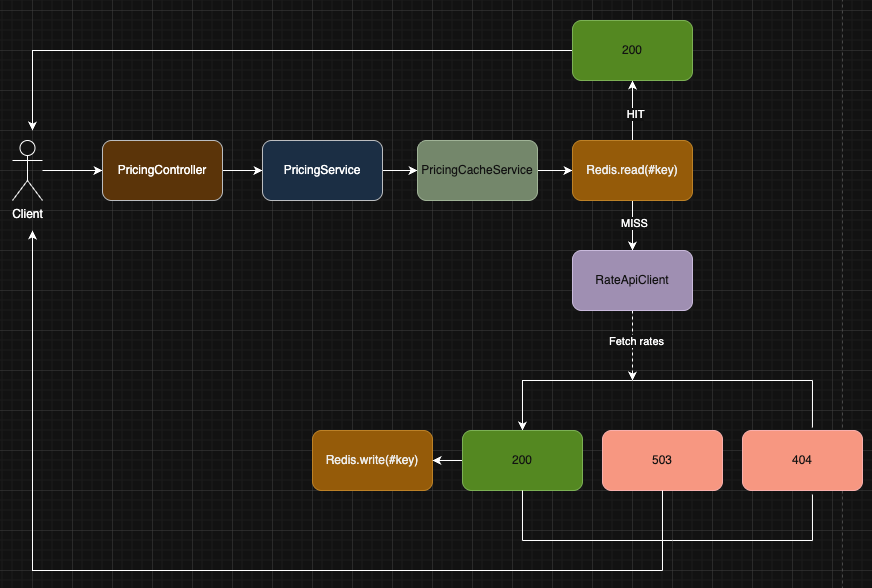

# Dynamic Pricing Take-home Assignment Solution

## Overview

A caching layer in front of Tripla's dynamic pricing model. The model is expensive
to run and has a hard limit of 1,000 API calls/day. The goal was to serve 10,000
user requests/day without blowing that budget, while always serving rates that are
**no older than 5 minutes**.

The scaffold already had the endpoint ready and calling the model on every request.
My job was to make that sustainable.

---
## Why I chose batch-all caching

My first instinct was to cache each `(period, hotel, room)` combination separately -
fetch on miss, cache for 5 minutes, done. Then I did the math:

- 4 seasons × 3 hotels × 3 rooms = **36 unique combinations**
- 24h/5min = **288 expiry windows per day**
- If each combination expires independently: 36 × 288 = **10,368 upstream calls/day**

That is 10x over the 1,000/day limit, even with caching enabled.

The model API supports **batch requests**, so I changed the strategy: on any cache
miss, fetch **all 36 combinations** in one call and cache each rate for 5 minutes.
That is **about 288 calls/day** with plenty of headroom.

---
## Why Redis and not memory store

`memory_store` works for a single process but not across Puma workers or containers -
each has its own memory, so one worker's cached rates are invisible to the others.
Redis is a shared store that all workers and containers read from and write to.

---
## Why a refresh lock

Average load is fine, but a deploy restart can start all workers with an empty cache. Without a
lock, 10 concurrent cold misses fire 10 upstream calls. A Redis `SET NX EX` lock
ensures only one process fetches at a time - everyone else waits, then reads from
the populated cache. One call per window instead of N.

The release uses a Lua script instead of a plain `DELETE`. If the holder crashes and
the TTL expires, another process can acquire the lock before the cleanup runs - a
plain `DELETE` would wipe it. The Lua script checks the token first, so only the
original holder can release its own lock.

---
## How cache misses are handled

Each rate is stored under its own Redis key - `pricing:rate:{period}:{hotel}:{room}`
- with a 5-minute TTL.

On a cache miss the service acquires the lock, fetches all 36 combinations in one
batch call, writes each returned rate, and releases the lock. Only combinations in
`PricingCatalog` are written - unknown rows are discarded. Concurrent misses wait for
the lock holder then read from cache. If the lock holder writes neither a rate nor a missing marker,
waiters raise a 503 rather than silently returning nil.

Combinations the upstream did not return are cached as missing for the same 5-minute
window and return 404. This avoids repeatedly calling upstream for a temporarily
unavailable combination. A partial response does not affect users asking for rates
that were returned.

---
## Architecture



- **`PricingController`** - validates params, delegates to `PricingService`, renders the response.
- **`PricingService`** - runs the service, maps errors to user-facing messages and HTTP status codes.
- **`RateCacheService`** - owns the cache logic. On miss, acquires a distributed lock, fetches all 36 combinations, writes each rate with a 5-minute TTL, and releases the lock.
- **`RateApiClient`** - HTTP wrapper. Handles batch requests, split timeouts, and normalizes all errors into `RateApiError`.
- **`PricingCatalog`** - single source of truth for valid periods, hotels, and rooms. Used by the controller for validation and by `RateCacheService` to build the batch request and filter unknown rows.

---
## Error handling

I split errors by whose fault they are:
- **400** - invalid or missing params. Caught before the service is called.
- **404** - valid params but the rate was not returned by the upstream in the latest batch.
- **503** - server-side failure: upstream timeout, upstream error, Redis unavailable, or an unexpected internal error.

I chose not to fall back to direct upstream calls when Redis is down. It feels
helpful but bypasses the rate-limit protection and risks exhausting the daily quota.
A 503 is more honest.

---
## Alternatives considered

**Proactive cache warming** - a background job refreshes all 36 combinations every
~4.5 minutes so the cache is always warm. Same API budget, better latency. I left it
out because at ~0.12 req/s the miss latency is infrequent and acceptable, and a
scheduler adds operational complexity I did not need yet.

**file_store** - works across Puma workers on the same host but not across containers.
Redis is the standard for shared cache in containerized Rails services.

**Single-key snapshot** - store all 36 rates in one Redis key. Simpler, but rejected
because partial upstream responses make the snapshot ambiguous. Per-combination keys
are explicit - each key either exists or is absent.

**race_condition_ttl** - Rails can serve stale data for a short grace window while
regenerating. Eliminated - the assignment says rates are valid for 5 minutes. Serving
beyond that would violate the core requirement.

---
## Known limitations

- **No proactive warming** - first request after each 5-minute window pays the upstream latency.
- **No retry on upstream failure** - a single error returns 503 immediately.
- **Single Redis instance** - no cluster HA. An outage returns 503 and does not degrade to unprotected upstream calls.

---
## How to run

```bash
docker compose up --build
```

The Rails app starts on `http://localhost:3000`.
Example requests:

**200:**
```bash
curl "http://localhost:3000/api/v1/pricing?period=Summer&hotel=FloatingPointResort&room=SingletonRoom"
```
```bash
curl "http://localhost:3000/api/v1/pricing?period=Winter&hotel=FloatingPointResort&room=RestfulKing"
```
**400:**
```bash
curl "http://localhost:3000/api/v1/pricing?period=Summer&hotel=FloatingPointResort"
```
---
## How to test

```bash
docker compose exec interview-dev ./bin/rails test
```

Tests use an in-memory cache store - no Redis required to run the test suite.

---
## Environment variables

- `RATE_API_URL` - URL of the upstream pricing API. Default: `http://localhost:8080`
- `RATE_API_TOKEN` - Auth token for the upstream API. Default: `04aa6f42aa03f220c2ae9a276cd68c62`
- `RATE_API_CONNECT_TIMEOUT` - TCP connection timeout in seconds. Default: `3`
- `RATE_API_READ_TIMEOUT` - HTTP read timeout in seconds. Default: `10`
- `REDIS_URL` - Redis connection URL. Required in production. Default: `redis://localhost:6379/0`
